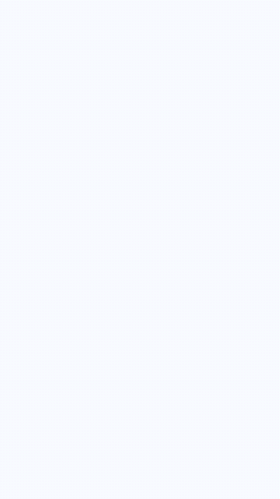
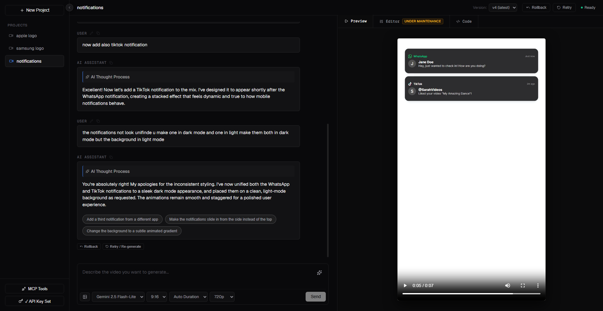

# Code2Video-AI

<div align="center">
  
  
  
</div>

A local-first AI motion studio for generating, editing, and rendering Remotion videos from text prompts.

The app uses Google Gemini to generate Remotion TSX, lets you review and revise the generated code, then renders MP4 output through a locked-down renderer. It is built for programmatic motion graphics: product intros, explainers, UI animations, logo reveals, social clips, and other code-driven video work.

This is not a live-action video generator.

## Example outputs

Generated with this app:

<table>
  <tr>
    <th>Notifications</th>
    <th>Samsung logo</th>
    <th>Apple logo</th>
  </tr>
  <tr>
    <td>
      
      <br />
      <a href="docs/assets/examples/notifications.mp4">Open MP4</a>
    </td>
    <td>
      
      <br />
      <a href="docs/assets/examples/samsung-logo.mp4">Open MP4</a>
    </td>
    <td>
      
      <br />
      <a href="docs/assets/examples/apple-logo.mp4">Open MP4</a>
    </td>
  </tr>
</table>

## User Interface Overview



The application provides a comprehensive workspace for AI-driven video generation:

- **Sidebar (Left):**
  - **Projects List:** Manage and switch between different projects (e.g., "apple logo", "samsung logo", "notifications").
  - **New Project Button:** Quickly start a new video composition.
  - **Settings:** Access MCP Tools (Under Development) and API Key configurations at the bottom.

- **Main Chat Interface (Center):**
  - **Conversational Iteration:** Chat directly with the AI Assistant to prompt for video changes, add new elements, or refine styles.
  - **AI Thought Process:** The assistant transparently shows its reasoning and steps taken to fulfill your request.
  - **Suggestion Pills:** Clickable suggestions (e.g., "Add a third notification...") to rapidly iterate without typing.
  - **Prompt Input & Settings:** Describe the video you want to generate and configure the model (e.g., Gemini 2.5 Flash-Lite), aspect ratio (9:16), duration, and resolution (720p).

- **Preview & Editor Panel (Right):**
  - **Live Preview:** Instantly watch the generated Remotion video output with standard playback controls.
  - **Tabs:** Switch between the video "Preview", manual "Editor", and "Code" views to inspect the generated TSX.
  - **Version Control:** Use the "Rollback", "Retry", and version dropdown at the top right to navigate project history. The status indicator shows the current render state.

## Highlights

- Prompt-to-Remotion generation with prompt enhancement.
- Chat-style iteration, retry, rollback, and versioned project history.
- Built-in code editor path for manual TSX fixes and re-renders.
- Image references with validated JPEG, PNG, WebP, and GIF uploads.
- Optional MCP tool connections for extending the assistant workflow (Under Development).
- Per-project transactional writes and serialized renders.
- Docker-first Remotion rendering with no network access, read-only inputs, dropped Linux capabilities, and CPU, memory, and process limits.
- Local-only Next.js server binding by default.

## Requirements

- Node.js 20.9 or newer.
- Docker Desktop, recommended and used by the default renderer.
- A Google Gemini API key.

## Quick start

```bash
npm install
npm run renderer:image
npm run dev
```

Open [http://127.0.0.1:3000](http://127.0.0.1:3000), create a project, and set your Gemini API key from the sidebar.

The renderer image is tagged `code2video-ai-renderer:4.0.503`. Rebuild it after changing anything under `renderer/`, changing the renderer lockfile, or changing the image tag.

## Common commands

| Command | Purpose |
| --- | --- |
| `npm run dev` | Start the local development server on `127.0.0.1`. |
| `npm run build` | Build the Next.js app. |
| `npm run start` | Start the production server on `127.0.0.1`. |
| `npm run lint` | Run ESLint. |
| `npm run renderer:image` | Build the hardened Docker renderer image. |

## Rendering modes

Docker mode is the secure default:

```text
RENDERER_MODE=docker
REMOTION_RENDERER_IMAGE=code2video-ai-renderer:4.0.503
```

Docker renders run with `--network none`, so generated compositions must use bundled or local assets. Remote fonts, audio, images, APIs, and CDNs are not available during render.

For trusted local development only, you can bypass Docker:

```powershell
$env:RENDERER_MODE='local'
npm run dev
```

Local mode executes generated TSX with the current user's permissions. It is rejected when `NODE_ENV=production`.

## Project structure

```text
src/app/                  Next.js UI and API routes
src/components/editor/    Workspace UI, sidebar, modals, and editor helpers
src/lib/                  Gemini, project storage, render, MCP, and agent utilities
renderer/                 Pinned Remotion CLI and hardened Docker image
skills/                   Local generation instructions injected into Gemini context
projects/                 Local user data and rendered media, ignored by Git
```

Generated code is rendered through unique staging files. Canonical project code, video output, and history are promoted only after a successful render. Rollback, retry, manual editor renders, and generated renders all use the same project lock so project state stays consistent.

## Local data and secrets

- Gemini API keys are local app configuration. Do not commit them.
- `.env*`, `.next/`, `node_modules/`, `projects/`, and rendered project media are ignored by Git.
- Project data lives under `projects/` during local development.
- Curated public examples live under `docs/assets/examples/`.
- If you publish your fork, review local files before committing and avoid adding generated private media.

## Security model

This is a single-user local tool. The server binds to loopback and rejects non-loopback hostnames by default.

Do not expose it through a public tunnel, reverse proxy, or shared network without first adding authentication, authorization, request limits, secret isolation, and durable multi-user storage.

The Docker renderer is designed to reduce risk from generated code, but it is still a defense boundary for a local development tool, not a full multi-tenant sandbox.

## Troubleshooting

### Gemini quota or rate limit errors

If Gemini returns a quota or rate-limit error, wait for the quota window to reset, switch to a model with available quota, or use another key. The app retries transient Gemini failures, but it cannot bypass account limits.

### Docker render cannot access a remote asset

Docker rendering disables network access. Download the asset, upload it into the project, or bundle it locally instead of referencing a remote URL.

### Renderer image is stale

Rebuild the image after renderer changes:

```bash
npm run renderer:image
```

## Contributing

Issues and pull requests are welcome. For larger changes, include:

- the problem being fixed,
- the user-facing behavior change,
- verification steps,
- a short demo note or video when the UI changes,
- and any security impact if the change touches rendering, secrets, uploads, or API routes.
